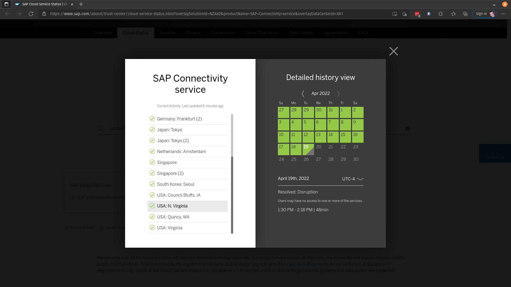
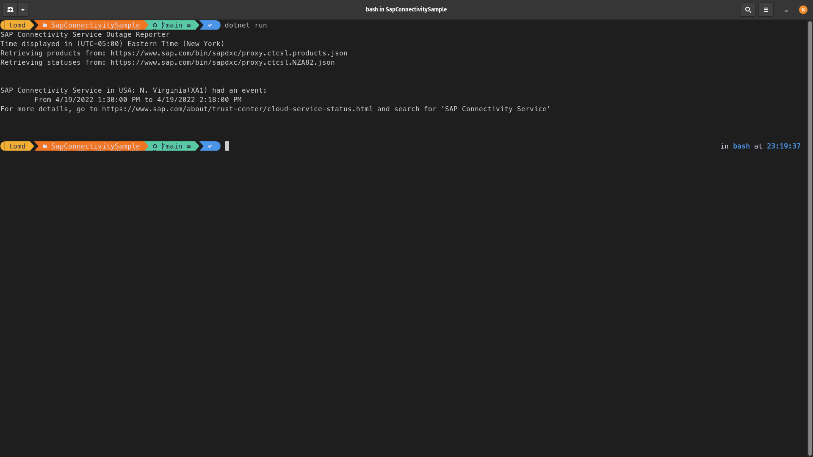

# SAP Connectivity Service Status
This is a sample project that makes use of making some API requests to SAP's **Trust Center**
for parsing cloud service outages. The service used for this example is the SAP Connectivity Service.  
Displaying the actual event description is currently not implement. All that is currently implemented 
is displaying the times between which an event occurred.

### Trust Center UI
The **SAP Trust Center**  website is the information we will retrieve programmatically.

### Program Output
The same information that is being displayed on the website will be shown in the program output as follows:  

## Running the sample
The sample can be ran on a local machine, or can make use of [Visual Studio Code Remote - Containers](https://code.visualstudio.com/docs/remote/containers) functionality. 

### Dependencies
For local development
 - [.NET 6.0](https://dotnet.microsoft.com/en-us/download/dotnet/6.0)  
 - A text editor like [Visual Studio Code](https://code.visualstudio.com/)

For [Visual Studio Code Remote - Containers](https://code.visualstudio.com/docs/remote/containers)  
 - [Visual Studio Code](https://code.visualstudio.com/)
 - A container runtime as mentioned in the [Containers requirements](https://code.visualstudio.com/docs/remote/containers#_system-requirements)  

### Running the code
The sample can be executed with the following terminal command: `dotnet run`